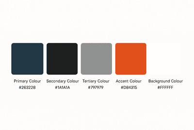

# Project Title

## Description

The <u>**Project title**</u> is a website that provides information about becoming a Jr. Developer. It is primarily targeted at members of the public who are looking to start a career in tech/full-stack development. Users of the site will be able to take a quiz on the subject of full-stack development (questions will be relevant for beginners) and <u>**be able to access information about beginning their journey and sign up for an email newsletter.**</u>

## UX

The website uses relatively bright colours with some darker ones used for both contrast and accessibility. The aim was to keep the colour scheme as light and friendly as possible as we want users to associate positivity with their desire to learn to code.

The colour palette was selected by utilising both ChatGPT and [Coolors](https://coolors.co/)
Colours chosen were:

- #2E7D32 **USED FOR X**
- #66BB6A **USED FOR X**
- #FBC02D **USED FOR X**
- #FF7043 **USED FOR X**
- #26A69A **USED FOR X**
- #F9FBE7 **USED FOR X**
- #212121 **USED FOR X**

## Colour Scheme

## Colour palette

## Typography

## Features

### Page 1

### Quiz

### Page 2

## Future development

## Tools and technologies

## Testing

## Deployment

## Contributors

## Resources

### Media

### Credits
